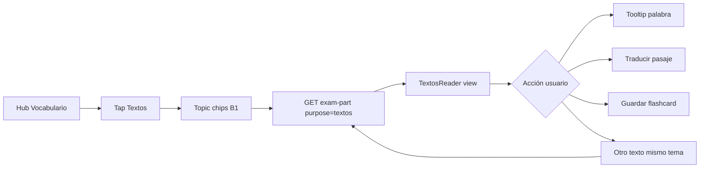

# Diseño técnico — feature **Textos** (Vocabulario)

**Fecha:** 2026-08-16  
**Estado:** diseño para revisión — **sin implementación**  
**Handoff producto (resumen):** lectura solo-lectura desde pool Lesen, selección **Vía A por tema**, tooltip palabra-a-palabra, traducción de pasaje completo cacheada por `texto+idioma`, guardado a flashcards, **excluir** partes reservadas por exámenes Oficiales publicados.

**Relacionado:** `PERSONAL-VOCAB-GTE3-DESIGN-2026-07-28.md`, `PERSONAL-TEXT-INDEX-PRECOMPUTE-DESIGN-2026-07-29.md`, `exam-part.js`, `reusablePartsStore.js`, `audit-pool-verified-usage.mjs`, `js/ui/workspace/vocabHub.js`, `js/ui/vocabulary/tooltip.js`, `js/engine/passageTranslate.js`, `js/ui/exam/examRunner.js` (`translatePassage`).

---

## 1. Resumen ejecutivo

| Pregunta | Decisión propuesta |
|----------|-------------------|
| ¿Endpoint nuevo o extensión? | **Extensión de `GET exam-part`** con `purpose=textos` — no nueva Netlify Function en v1 |
| ¿Cómo excluir Oficiales? | Índice offline **`official_reserved_parts:{lang}:{level}`** (set de `partId`) + flag en filas del pool snapshot |
| ¿UI? | **5.ª tarjeta** en hub Vocabulario → picker de tema → lector solo-lectura (sin preguntas) |
| ¿Traducción completa? | Reutilizar **`fetchVocabCache` / `putVocabCache`** + `PassageTranslate` (misma clave `texto+lang`) |
| ¿Tooltip palabra? | Reutilizar **`tooltip.js`** + `fetchVocab` (sin Gemini extra si hay caché) |
| Alcance v1 | **Lesen B1** (un pasaje por sesión); Hören/A2/B2 en fase 2 |
| Esfuerzo v1 | **~4–5 días dev** (detalle §8) |

---

## 2. Contrato de producto

### 2.1 Qué hace Textos

1. El usuario abre **Vocabulario** → tarjeta **Textos**.
2. Elige un **tema B1** (misma lista/normalización que custom exam / Vía A: `normalizeB1Topic`, alias Natur→Umwelt).
3. El servidor sirve **un pasaje Lesen** del pool verificado, **sin preguntas ni respuestas**.
4. Modo **solo lectura**:
   - hover/tap en palabra → tooltip con traducción contextual (mismo pipeline que examen practice).
   - botón **Traducir pasaje** → traducción completa en idioma UI (`translationLang()`).
5. Tap en palabra → **Guardar en flashcards** (mismo `ManualVocab` / deck del goal activo).
6. **No** debe servirse contenido cuyo `partId` figure en cualquier examen Oficial **live** del catálogo publicado.

### 2.2 Qué NO hace v1

- No ensambla módulo completo (5 Teile).
- No usa vocab del deck como filtro obligatorio (a diferencia de custom exam con `words=`).
- No incluye Hören (transcripción sin audio confunde UX; fase 2).
- No deduplica por hash de pasaje entre `partId` distintos (solo reserva por `partId`).

---

## 3. API — extensión de `exam-part` (recomendado)

### 3.1 Por qué extender y no crear función nueva

| Criterio | `exam-part` extendido | Función nueva `textos-pick` |
|----------|----------------------|----------------------------|
| Pool / Blobs / seed | ✅ ya cableado | Duplicaría imports |
| `pickReusablePartByTopic` (Vía A tema) | ✅ existe | Re-wrap |
| Rate limits / CORS | ✅ | Copiar |
| Deploy / cold start | 1 función menos | +1 función Free |

**Decisión:** extender **`GET /.netlify/functions/exam-part`** con parámetro dedicado **`purpose=textos`**.

### 3.2 Request (v1)

```http
GET /api/exam-part?lang=de&level=B1&module=lesen&purpose=textos&topicTag=Umwelt&exclude=id1,id2
Authorization: Bearer …   (opcional en v1 — ver §3.5)
```

| Param | Obligatorio | Notas |
|-------|-------------|-------|
| `lang`, `level`, `module=lesen` | sí | v1 solo `de` + `B1` + `lesen` |
| `purpose=textos` | sí | Activa rama Textos (distinto de `assembleMode=official\|practice`) |
| `topicTag` / `topic` | sí | Normalizado con `normalizeB1Topic` |
| `teil` | no | Si ausente: elegir Teil con más stock libre para ese tema (Teil 1–5 Lesen) |
| `exclude` | no | CSV de `partId` ya vistos en sesión (máx 40, como hoy) |

### 3.3 Response (v1)

```json
{
  "ok": true,
  "purpose": "textos",
  "id": "lesen-t2-gemini-113",
  "module": "lesen",
  "teil": 2,
  "topicTag": "Umwelt",
  "topicRelaxed": false,
  "reading": {
    "title": "…",
    "passageText": "…",
    "wordCount": 142,
    "sourcePartId": "lesen-t2-gemini-113"
  },
  "meta": {
    "officialReserved": false,
    "servedCount": 3
  }
}
```

**Transformación servidor (`toTextosReadingPayload(part)`):**

- Extraer texto con la misma función que auditoría: `partText(part)` / `extractRecordPassageText`.
- **No** incluir `questions[]`, `correct`, `explanation`, ni `options`.
- Incluir `title`, `subtitle`, `instruction` solo si son metadatos de lectura (no enunciados de examen).
- Para Lesen T4/T5 multi-bloque: v1 sirve **un bloque** (primer pasaje continuo >80 W o pasaje principal del Teil).

Error paths:

| Código | `error` | Cuándo |
|--------|---------|--------|
| 404 | `textos_no_match` | Ninguna parte libre para tema+teil |
| 503 | `official_index_stale` | Prod sin índice reservado (fail-fast, §4) |
| 429 | `rate_limited` | Mismo bucket que pick pool clásico |

### 3.4 Implementación servidor (pseudocódigo)

```
GET exam-part:
  if purpose === 'textos':
    assert module === 'lesen'
    reserved ← loadOfficialReservedSet(lang, level)   // Blob o seed estático
    excludeAll ← union(excludeIds, reserved)
    pick ← pickReusablePartByTopic(store, lang, level, 'lesen', {
      topicTag, teil, excludeIds: excludeAll, assembleMode: 'practice'
    })
    if !pick → 404 textos_no_match
    payload ← toTextosReadingPayload(pick.part)
    return { ok: true, purpose: 'textos', id: pick.id, reading: payload, … }
```

Reutiliza **`pickReusablePartByTopic`** tal cual Vía A (escasez `servedCount`, filtro tema estricto con relax implícito si pool vacío — mismo comportamiento que personal topic pick).

### 3.5 Auth y cuota v1

| Opción | Pros | Contras |
|--------|------|---------|
| **A — público** (como pick pool sin `words=`) | Cero fricción; lectura no revela respuestas | Scraping de pasajes |
| **B — login required** | Alineado con Pro | Más barrera |

**Recomendación v1:** **A (público)** con rate limit **`checkExamPartVocabRateLimit`** en picks con `purpose=textos` (1 pick ≈ 1 GET clásico). Traducción completa sigue consumiendo crédito AI vía `callAI`/`vocab-cache` existente.

---

## 4. Exclusión de contenido Oficial publicado

### 4.1 Unidad de reserva

**Átomo = `partId`** (ej. `lesen-t2-gemini-113`), no pregunta suelta ni hash de pasaje.

Motivo: el catálogo publicado ya referencia partes completas:

```json
{ "partId": "horen-t4-gemini-007", "cell": "horen-t4", "snapshot": { … } }
```

Un `partId` en un Oficial **live** implica que **todo el fragmento pool** asociado está reservado para ese examen.

### 4.2 Fuente de verdad

| Artefacto | Path |
|-----------|------|
| Catálogo | `library/published-exams/de/{level}/_catalog.json` → exams `status: "live"` |
| Manifiestos | `library/published-exams/de/{level}/{examId}.json` → `parts[].partId` |

Lógica existente a reutilizar: **`scripts/audit-pool-verified-usage.mjs`** → `loadOfficialPvFiles()` (ya cruza catálogo ↔ partIds).

### 4.3 Índice propuesto

**Blob key:** `official_reserved_parts:de:B1` (y `:de:A2`, etc.)

```json
{
  "indexVersion": "v1",
  "builtAt": "2026-08-16T…",
  "level": "B1",
  "lang": "de",
  "liveExamCount": 19,
  "reservedPartIds": [
    "lesen-t1-gemini-155",
    "horen-t4-gemini-007",
    "…"
  ],
  "byPartId": {
    "lesen-t1-gemini-155": {
      "exams": ["official-de-B1-e2"],
      "cells": ["lesen-t1"]
    }
  }
}
```

**Script offline:** `scripts/build-official-reserved-index.mjs`

- Input: catálogo + manifiestos del nivel.
- Output: JSON en repo (`library/official-index/de_B1.json`) **y** upload a Blobs en deploy.
- Hook: post-publicación/republicación de examen Oficial (mismo pipeline que `publishedExamLib.mjs`).

### 4.4 Runtime — distinguir libre vs reservado

En **`poolSearchCache.js` / snapshot rows**, añadir campos derivados del índice:

```json
{
  "id": "lesen-t2-gemini-113",
  "officialReserved": false,
  "officialExamIds": []
}
```

| `officialReserved` | Significado para Textos |
|--------------------|-------------------------|
| `false` | Elegible |
| `true` | **Nunca** servir en `purpose=textos`; sigue elegible para custom exam practice si no está en quarantine |

**Filtro en pick:**

```javascript
function filterRowsForTextos(rows, reservedSet) {
  return rows.filter(r => !reservedSet.has(r.id) && r.complete && !r.disabled);
}
```

Prod: si índice ausente → **`503 official_index_stale`** (misma política que snapshot pool en Free, §6.6 PERSONAL-TEXT-INDEX).

### 4.5 Casos borde

| Caso | v1 | Fase 2 |
|------|----|--------|
| Mismo texto, distinto `partId` | Ambos servibles si solo uno está en Oficial | Hash `passageTextNorm` cross-reserve |
| Examen retirado del catálogo (`status != live`) | Rebuild índice → partId liberado | — |
| Parte en Oficial pero usuario hace custom exam practice | Permitido hoy (no es Textos) | Política producto |
| Schreiben/Sprechen en pool | Fuera de alcance Textos | — |

---

## 5. UI — tarjeta y flujo

### 5.1 Hub Vocabulario (5 tarjetas)

Estado actual (`vocabHub.js`): grid con **Custom exam**, **Flashcards**, **AI quiz**, **Listening game**, **Phrases**.

**Propuesta layout:**

```
┌──────────────── Custom exam ────────────────┐
┌─ Flashcards ─┐  ┌─ Textos (NEW) ─────────────┐
└──────────────┘  └────────────────────────────┘
┌─ AI quiz ────┐  ┌─ Listening game ───────────┐
└──────────────┘  └────────────────────────────┘
┌─ Phrases ───────────────────────────────────┐
└─────────────────────────────────────────────┘
```

| Elemento | Valor |
|----------|-------|
| `activity` key | `textos_read` |
| Icono | 📖 |
| Título | **Textos** |
| Desc | `Pick a topic · read-only · tap words to translate` |
| Badge | ninguno (v1 sin crédito AI en pick; traducción pasaje sí) |
| Gate | `isAiFeatureAllowed` **no** requerido para abrir lector; sí para traducir pasaje |

Cambios en `vocabHub.js`:

- `vocabHubActionsHtml`: botón `textos_read`.
- `vocabHubTapActivity`: rama → `launchVocabHubTextos()`.
- Estado `_vocabHub.textosTopic`, `_vocabHub.textosExcludeIds[]`.

### 5.2 Flujo pantallas



**Pantalla lector (`js/ui/workspace/textosReader.js` — nuevo):**

1. Header: tema + Teil + botón ← volver al hub.
2. Cuerpo: `formatReadableText(passageText, blockId, /*practice=*/true)` → spans `.vocab-word` (mismo que exam runner practice).
3. Toolbar:
   - **Traducir pasaje** → `translatePassage(blockId)` (copiar lógica de `examRunner.js`, sin preguntas).
   - **Otro texto** → mismo tema, `exclude` += último `partId`.
4. **Sin** barra de progreso de examen, sin submit, sin official mode banner.
5. Tooltip: registrar delegado `bindVocabTooltip(container)` una vez.

### 5.3 Guardado a flashcards

Reutilizar **`showVocabFromSpan` → botón Save** del tooltip existente:

- Misma validación POS (`ManualVocab.inferPos`, guards conjunción).
- Deck = `deckForGoal(getActiveGoal())`.
- Tras guardar: toast + opcional `VocabBatching.recordActivityUsage(goal, 'textos_read', [word])` (nueva activity key para analytics).

No requiere endpoint nuevo.

---

## 6. Traducciones y caché

### 6.1 Palabra (tooltip)

| Capa | Mecanismo |
|------|-----------|
| Cliente | `fetchVocab(word, contextSentence)` → `S.vocabCache[word_subject_lang]` |
| Servidor | `vocab-cache` Netlify + Gemini Flash (`freeTranslate.js`) |
| Clave | `lemma/surface + fromLang + toLang` (+ contexto en prompt) |

Sin cambios de schema v1.

### 6.2 Pasaje completo

| Capa | Mecanismo |
|------|-----------|
| Cliente | `translatePassage` + `fetchVocabCache(from, lang, meta.text)` |
| Validación | `PassageTranslate.isCompletePassageTranslation(source, tr)` |
| Persistencia | `putVocabCache(from, lang, fullText, translation, 'ai')` |
| Clave | **Texto alemán completo normalizado (trim)** + idioma destino |

**Cache hit** → cero Gemini. **Miss** → 1× `callAI` con `PassageTranslate.buildPassagePrompt` (mismo que exam practice).

### 6.3 Límites

- Pasaje >120 chars → ruta pasaje (`PASSAGE_WORD_LOOKUP_MAX`).
- Output tokens: `passageOutputMaxTokens(charCount)` (hasta 4096).
- Rate: hereda cuota AI usuario (`translation` action).

---

## 7. Selección Vía A por tema (detalle)

Textos **no** pasa `words=` → no usa `planPersonalModuleAssembly` ni `pickReusablePartByVocab`.

Usa **`pickReusablePartByTopic`** con:

1. `topicTag` usuario (normalizado).
2. `excludeIds` = vistos sesión ∪ reservados Oficial.
3. `assembleMode=practice` (quarantine length/lexical sigue aplicando).
4. Desempate: menor `servedCount`, random tie-break (código actual).

**Relax de tema:** si 0 filas con tema estricto, comportamiento actual de `pickReusablePartByTopic` es devolver `null` — para Textos conviene **fallback explícito** documentado:

- Intentar strict topic.
- Si vacío → 404 con mensaje UI “No hay textos para este tema todavía” (no servir tema aleatorio sin avisar).

Opcional v1.1: relax como custom exam (`topicRelaxed: true` en response).

---

## 8. Estimación de esfuerzo

| Bloque | Tareas | Días |
|--------|--------|------|
| **Índice Oficial** | `build-official-reserved-index.mjs`, JSON B1, integrar en deploy, tests | 0.75 |
| **Backend** | Rama `purpose=textos` en `exam-part`, `toTextosReadingPayload`, filtro reservados, tests unit | 1.0 |
| **UI hub + reader** | Tarjeta, topic picker, `textosReader.js`, estilos, navegación | 1.25 |
| **Integración lectura** | `formatReadableText`, tooltip bind, translatePassage, save flashcard | 0.75 |
| **QA / smoke** | Script CHK + e2e manual B1, gate-logs evidencia | 0.5 |
| **Total v1 (B1 Lesen)** | | **~4.25 → redondear 4–5 días** |

| Extensión | Delta |
|-----------|-------|
| A2 Lesen | +1 d (índice + QA) |
| Hören (transcripción) | +1.5 d (UX audio/texto, extracción transcript) |
| Reserva por hash pasaje | +1 d |

---

## 9. Plan de implementación (post-aprobación)

1. Script índice + commit `library/official-index/de_B1.json`.
2. `filterRows` / snapshot: flags `officialReserved`.
3. `exam-part` rama `purpose=textos`.
4. UI tarjeta + reader.
5. Smoke: `scripts/smoke-textos-pick-b1.mjs` — assert 0 picks con partId reservado, 6 fixes manual spot-check.
6. Deploy único; verificar con `post-deploy` existente.

---

## 10. Criterios de aceptación

- [ ] Ningún `GET purpose=textos` devuelve `partId` presente en índice reservado B1 live.
- [ ] Response **sin** `questions`, `correct`, `explanation`.
- [ ] Tooltip y guardado flashcard funcionan en lector igual que practice exam.
- [ ] Segunda traducción mismo pasaje+idioma → cache hit (sin `callAI`).
- [ ] Tarjeta visible junto a las 4 actividades existentes; no rompe caps VocabBatching de otras actividades.
- [ ] Documentación operador: cuándo rebuild índice tras publicar Oficial.

---

## 11. Riesgos

| Riesgo | Mitigación |
|--------|------------|
| Pool B1 agotado por tema tras excluir ~247 partIds Oficial | Métrica en smoke; relax tema v1.1 |
| Drift índice vs catálogo | Rebuild en cada publish; `indexVersion` |
| Usuario memoriza pasajes libres | Acceptable; no son exámenes Oficiales |
| Scraping pasajes | Rate limit GET; login en v2 si abuso |

---

*Documento de diseño únicamente — no implica cambios desplegados.*
