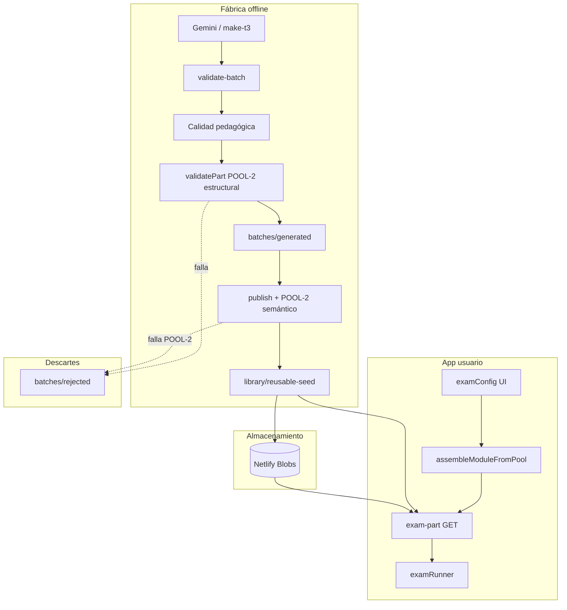

# Auditoría general de LexiLoop — flujo de generación de exámenes

Documento orientado a alguien que **no conoce el proyecto** y quiere entender qué hace cada pieza, dónde viven los datos y qué filtros de calidad se aplican antes de que un examen llegue al usuario.

**Última actualización:** julio 2026  
**Relacionado:** [`personal-exam-pool-first-architecture.md`](./personal-exam-pool-first-architecture.md), [`pool-content-map.md`](./pool-content-map.md)

---

## 1. Qué es LexiLoop (visión general)

**LexiLoop** es una app web de preparación de exámenes oficiales (Goethe B1 alemán, DELE, Cambridge, etc.). Tiene dos capas distintas que conviene no mezclar:

| Capa | Qué es | Dónde vive |
|------|--------|------------|
| **App (runtime)** | Lo que ve el usuario: flashcards, configurador de práctica, runner del examen | `js/`, `index.html`, Netlify Functions |
| **Fábrica de contenido (offline)** | Scripts Node que generan, validan y publican preguntas/partes con IA (Gemini) | `scripts/`, `batches/` |
| **Biblioteca de contenido** | JSON estático: banco de preguntas, blueprints, pool reutilizable | `library/`, `data/` |

La app **no genera exámenes en el navegador**. Ensambla partes desde un **pool** o, en rutas legacy, pide chunks a la IA vía `claude-chat`. La generación masiva ocurre **offline** con scripts y se sube al pool.

---

## 2. Conceptos clave antes de entrar al flujo

### Examen vs parte

- **Parte (reusable part):** un bloque oficial completo de un módulo — p. ej. *Lesen Teil 3* (7 anuncios A–J), *Hören Teil 2* (5 MCQ). Es la unidad del **pool personalizado**.
- **Examen completo:** 4 módulos Goethe B1 (Lesen 5 Teile + Hören 4 + Schreiben 3 + Sprechen 3) o un subconjunto elegido por el usuario (p. ej. solo Lesen).

### Tres orígenes de contenido

| Origen | Uso | Ubicación típica |
|--------|-----|------------------|
| **Pool personal** | Práctica con vocabulario del usuario (pool-first) | `library/reusable-seed/`, Netlify Blobs |
| **Banco clásico** | Preguntas sueltas mergeadas por Teil | `library/de/B1/questions.json` |
| **Exámenes oficiales/curados** | Demo, Official, Practice completos | `library/published-exams/`, `library/curated/`, `data/exams/` |

### Blueprint

Plantilla oficial del examen: cuántos ítems por Teil, tipos de pregunta, tiempos.

- Archivo: `library/blueprints/goethe_B1.json`
- Todo validador compara contra este blueprint.

---

## 3. Mapa de carpetas (lo esencial)

```
lexiloop/
├── batches/                    ← FÁBRICA: generación offline
│   ├── generated/              Borradores que pasaron validación de formato/calidad
│   ├── generated/.rejected/    Rechazos del generador (con _rejectedReason)
│   ├── rejected/               Partes malas movidas al fallar publish/POOL-2
│   ├── merged/                 Pipeline legacy (batches manuales aprobados)
│   ├── inbox/                  Prompts y todos para pegar/subir
│   ├── templates/              Plantillas JSON por módulo/Teil
│   └── topic-pools/            Pools de temas aleatorios por idioma
│
├── library/                    ← BIBLIOTECA CANÓNICA (se copia a dist/ en build)
│   ├── blueprints/             Estructura oficial Goethe/Cambridge/DELE
│   ├── de/B1/questions.json    Banco plano (passages + questions)
│   ├── reusable-seed/          ★ POOL LOCAL de partes reutilizables
│   │   ├── de_B1.json          Partes verificadas + topicTag + vocabIndex
│   │   └── de_B1.bank.json     Partes extra sincronizadas del banco
│   ├── pool-stock/             Manifests de stock (tema×Teil) para UI/planner
│   ├── curated/                Exámenes curados completos
│   ├── published-exams/        Exámenes oficiales publicados (inmutables)
│   └── vocab/                  Listas CEFR por nivel
│
├── staging/                    Cola de revisión pre-banco
│   └── de/B1/candidates/       Candidatos pendientes de promote
│
├── data/
│   ├── exams/                  Exámenes servibles en la app (curated final)
│   ├── coverage/               Lemas flojos (weak-de_B1.json) para rotación vocab
│   └── demo/                   Exámenes demo
│
├── js/                         App browser + motor compartido
│   ├── ui/exam/                examConfig, examGeneration, examRunner
│   ├── services/claudeClient.js  Llamadas a Netlify (exam-part, claude-chat)
│   ├── engine/                 Validadores, prompts, pool fallback
│   └── library/                ExamBlueprint, ExamBuilder, LibraryLoader
│
├── netlify/functions/          Backend producción
│   ├── exam-part.js            GET pool / POST ingest parte
│   ├── claude-chat.js          IA + gates en vivo
│   ├── exam-pool.js            Exámenes completos pre-montados
│   └── lib/                    webPartGate, partQualityGate, reusablePartsStore
│
├── scripts/                    ~200+ scripts CLI (generación, publish, audit)
└── docs/                       Arquitectura (pool-first, pool-content-map, audit)
```

**Regla de oro:** lo que está en `library/reusable-seed/` y Netlify Blobs es lo que alimenta la **práctica personal pool-first**. Lo de `batches/rejected/` **nunca** debe mezclarse con el pool.

---

## 4. Estructura de un examen Goethe B1 DE

| Módulo | Teile | Contenido típico |
|--------|-------|------------------|
| **Lesen** | 1–5 | T1 R/F texto · T2 MCQ 2 textos · T3 matching anuncios · T4 Ja/Nein · T5 MCQ foro |
| **Hören** | 1–4 | T1 diálogos cortos · T2 monólogo · T3 discusión · T4 matching |
| **Schreiben** | 1–3 | Foro, email formal, texto argumentativo |
| **Sprechen** | 1–3 | Planificar, presentar, discutir |

Cada Teil tiene **conteo fijo de ítems** definido en `scripts/audit-pass-2.mjs` (BLUEPRINT) y en el blueprint JSON.

---

## 5. Flujo A — Fábrica offline (cómo nace una parte buena)

Este es el camino principal para **rellenar el pool**. Lo automatiza `scripts/pool-fill-teil.mjs` (comando unificado por módulo+Teil).

```
┌─────────────────────────────────────────────────────────────────┐
│ 1. PLANIFICACIÓN                                                │
│    pool-gap-planner: tema escaso + vocab flojo (weak-de_B1)    │
└────────────────────────────┬────────────────────────────────────┘
                             ▼
┌─────────────────────────────────────────────────────────────────┐
│ 2. GENERACIÓN                                                   │
│    Lesen T1,T2,T4,T5 → Gemini (generate-lesen-part-gemini)     │
│    Lesen T3          → make-t3.mjs (determinista, 0 API)         │
│    Hören/Schreiben/Sprechen → generatePartGeminiLib            │
│    Salida provisional: batches/generated/*.json                 │
└────────────────────────────┬────────────────────────────────────┘
                             ▼
┌─────────────────────────────────────────────────────────────────┐
│ 3. FILTROS EN GENERACIÓN (ver sección 6)                        │
└────────────────────────────┬────────────────────────────────────┘
                             ▼
┌─────────────────────────────────────────────────────────────────┐
│ 4. PUBLICACIÓN (solo con --publish)                             │
│    publish-lesen-generated / publish-exam-generated             │
│    → POOL-2 semántico → staging → banco → reusable-seed/Blobs  │
└────────────────────────────┬────────────────────────────────────┘
                             ▼
┌─────────────────────────────────────────────────────────────────┐
│ 5. POOL FINAL                                                   │
│    library/reusable-seed/de_B1.json (+ Blobs en prod)           │
│    build-pool-stock-manifest → library/pool-stock/              │
└─────────────────────────────────────────────────────────────────┘
```

### Comandos de entrada típicos

```bash
# Un Teil de punta a punta (tema+vocab rotando)
node scripts/pool-fill-teil.mjs --module lesen --teil 3 --target 5 --rotate-every 2 --publish

# Factory Lesen en volumen
node scripts/factory-lesen.mjs --per-teil-target 5 --max-api-calls 80

# Ver huecos sin generar
node scripts/pool-fill-teil.mjs --module lesen --teil 3 --status

# Regenerar manifest de stock
node scripts/build-pool-stock-manifest.mjs
```

---

## 6. Filtros de calidad (detalle por capa)

Los gates se apilan en **capas**. Una parte puede fallar en cualquiera; solo las que pasan **todas** las capas relevantes entran al pool.

### Capa 1 — Validación técnica (`validate-batch.mjs`)

**Archivo:** `scripts/validate-batch.mjs`

**Qué comprueba:**

- JSON parseable
- Esquema Ajv (`library/schemas/questions.schema.json`)
- Campos obligatorios (`id`, `module`, `question`, `correct`)
- `passageId` coherente con passages del batch
- IDs no duplicados respecto al banco (salvo `--allow-dup`)
- Colocación simulada en el blueprint (¿encaja en un Teil?)

**Cuándo:** inmediatamente tras generar; también en publish.

**Si falla:** no se considera batch válido; reintento con corrección LLM o descarte.

---

### Capa 2 — Calidad pedagógica por módulo

| Módulo | Script | Qué busca |
|--------|--------|-----------|
| **Lesen** | `scripts/lib/lesenBatchQuality.mjs` | Anti word-matching, trampas de alcance (alle/jede/immer), balance R/F, calidad MCQ |
| **Hören** | `scripts/lib/horenBatchQuality.mjs` | Transcripción, turnos de diálogo, opciones sustanciales, longitudes |
| **Schreiben/Sprechen** | `scripts/lib/promptBatchQuality.mjs` | Rúbrica Goethe: longitud, registro, puntos pedidos |

**Cuándo:** tras validate-batch, antes de escribir en `batches/generated/`.

---

### Capa 3 — Cobertura CEFR (solo Lesen ingest)

**Script:** `scripts/lib/lesenBatchIngestCheck.mjs`

Comprueba que el batch no use vocabulario fuera de banda B1 de forma excesiva. Bloquea ingest pedagógico antes de staging.

---

### Capa 4 — Gate estructural POOL-2 (`audit-pass-2.mjs` → `isPartPoolReady`)

**Archivos:** `scripts/audit-pass-2.mjs`, `scripts/lib/partGate.mjs`

**El filtro más importante para el pool.** Audita la parte como registro reutilizable con checks **CHK-1 … CHK-25**, por ejemplo:

- Tipos canónicos (`richtig_falsch`, `multiple_choice`, `matching`, …)
- Conteo de ítems vs blueprint (6 preguntas T1, 7 T3, etc.)
- Claves de respuesta válidas y balance MCQ
- Blacklist de vocabulario C1/C2
- Duplicación de contenido (Jaccard entre pasajes)
- Coherencia passageId / transcript (Hören)
- CHK-23: conflictos de claves en registros Hören

**Política POOL-2:** bloquea si hay findings **CRITICAL** o **IMPORTANT** activos (`GATE_BLOCK_CHECKS`).

Hay checks en `GATE_BLOCK_PENDING` que aún son solo aviso pero pasarán a bloqueantes en fases posteriores.

**Modo semántico (`semantic: true`):** añade **SEM-1** vía `scripts/lib/semanticValidator.mjs` — una llamada LLM por parte que revisa corrección de claves, ambigüedad, distractores.

Se usa en **publish** (`publish-lesen-generated.mjs`), no siempre al guardar borrador.

```
POOL-2 OK  =  0 CRITICAL  +  0 IMPORTANT  (+ SEM-1 si semantic:true)
```

---

### Capa 5 — Dedup y léxico (`partGate.mjs` → `validatePart`)

**Archivo:** `scripts/lib/partGate.mjs`

Wrapper usado en generación y en runtime:

- Normaliza batch → registro pool
- Dedup contra corpus existente en `batches/generated/` (similitud Jaccard)
- `scripts/lib/lexicalCheck.mjs` — coherencia léxica contextual
- Llama a `isPartPoolReady`

---

### Capa 6 — Validación semántica LLM (`semanticValidator.mjs`)

**Archivo:** `scripts/lib/semanticValidator.mjs`

Un LLM revisa por parte:

- ¿La clave marcada es correcta?
- ¿Hay ambigüedad?
- ¿Los distractores son plausibles?

Cacheada por hash de contenido. En publish falla cerrado; si el validador crashea, fail-open (solo en edge cases).

---

### Capa 7 — Publish gate (`publish-lesen-generated.mjs`)

**Archivos:** `scripts/publish-lesen-generated.mjs`, `scripts/publish-exam-generated.mjs`

Stack completo al publicar:

1. `validateLesenBatch` (capas 1–3)
2. **`isPartPoolReady(..., { semantic: true })`** — POOL-2 estricto
3. Si OK → `scripts/ingest-to-staging.mjs --auto-approve`
4. → `scripts/promote-approved.mjs` → escribe en `library/de/B1/questions.json`
5. Opcional `--sync-pool` → `scripts/seed-reusable-from-bank.mjs` → `library/reusable-seed/` + Blobs

**Si POOL-2 falla:** archivo marcado `rejected: true`, **no entra al banco**. Suele moverse a `batches/rejected/`.

---

### Capa 8 — Gate runtime en vivo (`webPartGate.js` + `claude-chat.js`)

**Archivos:** `netlify/functions/lib/webPartGate.js`, `netlify/functions/claude-chat.js`

Solo si se usa generación **en vivo** (path legacy/híbrido):

```
Usuario pide examen → claude-chat genera chunk JSON
  → gatePersonalExamChunk()
  → validatePart(semantic: true)
  → si falla: HTTP 422 part_gate_rejected + devolución de crédito
```

Misma filosofía POOL-2, pero sobre chunks generados al vuelo.

---

### Capa 9 — Examen completo (`examQualityGate.js`)

**Archivo:** `netlify/functions/lib/examQualityGate.js`

Para exámenes **enteros** (no partes sueltas):

- `ExamValidator` estructural
- Fidelidad al blueprint
- Conteo de placeholders
- Opcional: verificación de claves con IA
- Coherencia temática (`netlify/functions/lib/topicCoherenceGate.js`)

Usado en `claude-chat` con `validateExam:true`, `exam-pool.js`, pipeline de curación.

---

### Resumen: stacks típicos

| Camino | Gates aplicados |
|--------|-----------------|
| **Guardar borrador** (Gemini) | validate-batch → calidad pedagógica → validatePart (estructural) → `batches/generated/` |
| **Publish al pool** | Lo anterior + **isPartPoolReady(semantic:true)** → staging → banco → reusable-seed |
| **Chunk live personal** | claude-chat → **webPartGate** → validatePart(semantic:true) |
| **Examen completo curado** | examQualityGate + topicCoherence |

---

## 7. Flujo B — Runtime: examen personal pool-first (lo que usa el usuario hoy)

Política actual B1 DE: **sin IA en tiempo real** para ensamblar; todo desde pool.

```
Usuario en examConfig
  → elige módulo (Lesen/Hören/Schreiben) + vocab + tema (Lesen)
  → generatePersonalExam() [js/ui/exam/examGeneration.js]
  → assembleModuleFromPool() por cada módulo
      → fetchExamPartVocab() [js/services/claudeClient.js]
          → GET /.netlify/functions/exam-part
              → pickReusablePartByVocab / pickReusablePartByTopic
              → busca en Blobs o fallback local reusable-seed
  → merge lesenParts + horenParts + …
  → finalizePersonalExam() → examRunner
```

**Criterios de selección en pool:**

- `topicTag` B1 canónico (16 temas: Technik, Umwelt, …) — ver `js/data/b1Topics.js`
- Vocabulario del usuario: `vocabIndex` debe intersectar con palabras del deck
- Excluye partes ya vistas (`seenPartIds` en historial usuario)
- Si falta celda `(tema × Teil)`: `missingTeile`, toast honesto, examen parcial

**Dónde queda el “examen final” para el usuario:**

No se persiste como archivo JSON en disco del servidor. Vive en **memoria de sesión** (`S.examData`) durante la práctica. Las **partes** sí están persistidas en pool.

---

## 8. Flujo C — Generación en vivo / híbrido (legacy, desactivado en producto)

Todavía existe en código pero **B1 DE personal** fuerza pool-first (`EXAM_POOL_ONLY=true`, `isPersonalModulePoolFirst`).

```
generatePersonalExamAiSerial()
  → preload Hören T1/T4 from pool
  → LexiCoilEngine.generatePersonalExam() chunk a chunk
  → POST claude-chat (55s timeout)
  → webPartGate (422 si falla)
  → merge con partes pool preloaded
```

Problemas que motivaron pool-first: timeouts Netlify 60s, `part_gate_rejected`, coste API, UX de retry.

---

## 9. Flujo D — Exámenes oficiales / curados (otro producto)

```
Generación batch (11 partes) → merge → curate pipeline
  → library/curated/de/B1/curated_*.json
  → data/exams/de_B1.json (servible en app)
  → publish-exam.mjs → library/published-exams/de/B1/official-*.json
```

Estos son exámenes **completos fijos**, no el pool personal por Teil. La app los sirve en modos Official/Practice/Demo.

---

## 10. Separación buenos / malos (control de calidad operativo)

| Estado | Carpeta | ¿Entra al pool/banco? |
|--------|---------|------------------------|
| Borrador validado (formato+calidad) | `batches/generated/` | No aún |
| Rechazado en generación | `batches/generated/.rejected/` o `batches/.rejected/` | No |
| Rechazado en publish POOL-2 | `batches/rejected/` | **No** |
| Aprobado en staging | `staging/de/B1/candidates/` | Intermedio |
| En banco | `library/de/B1/questions.json` | Sí (banco clásico) |
| En pool personal | `library/reusable-seed/de_B1.json` | **Sí (fuente personal)** |
| Producción | Netlify Blobs `reusable_part:*` | **Sí (prod)** |

---

## 11. Índices y metadatos del pool

Cada parte buena en reusable-seed lleva:

| Campo | Para qué |
|-------|----------|
| `topicTag` | Tema B1 (Technik, Umwelt, …) — búsqueda por tema |
| `vocabIndex[]` | Lemas presentes — matching con vocab usuario |
| `complete`, `verified` | Flags de elegibilidad |
| `module`, `teil` | Celda del blueprint |

Manifest de stock: `library/pool-stock/de_B1-lesen.json` (generado por `scripts/build-pool-stock-manifest.mjs`).

Alimenta badges en UI (✓ completo / wenig Inhalt / Lücken).

---

## 12. Backend Netlify (funciones clave)

| Función | Rol |
|---------|-----|
| `exam-part.js` | **GET:** sirve parte del pool. **POST:** ingesta parte nueva con `partQualityGate` |
| `claude-chat.js` | Proxy Anthropic/Gemini; chunks personal + `validateExam`; part gate en vivo |
| `exam-pool.js` | Exámenes completos pre-validados |
| `exam-hybrid-execute.js` | Tickets de ejecución híbrida (legacy) |
| `reusablePartsStore.js` | CRUD partes en Blobs + índice `partIndex.buscar()` |

Store Blobs: `lexicoil-data`, claves `reusable_part:de:B1:lesen:{id}`.

---

## 13. Diagrama mental completo



---

## 14. Scripts npm de referencia

### Generación y pool fill

| Script npm | Comando |
|------------|---------|
| `pool:fill` | `node scripts/pool-fill-teil.mjs` |
| `pool:fill:lesen:t3` | Lesen T3, 5 partes, publish |
| `pool:stock` | Regenera manifest de stock |
| `factory:lesen` | Factory volumen Lesen |
| `generate:lesen:gemini` | Generador Lesen unitario |
| `generate:part:gemini` | Hören/Schreiben/Sprechen |

### Publish pipeline

| Script npm | Etapa |
|------------|-------|
| `lesen:publish:pool:t1`…`t5` | publish + sync-pool |
| `horen:publish:pool:t1`…`t4` | publish Hören |
| `pipeline:ingest` | ingest-to-staging |
| `pipeline:promote` | promote-approved → banco |
| `lesen:sync:pool` | banco → reusable-seed |

### Calidad y auditoría

| Script npm | Rol |
|------------|-----|
| `check:lesen:quality` | Calidad pedagógica Lesen |
| `check:horen:quality` | Calidad pedagógica Hören |
| `audit:pool:quality` | Auditoría pool POOL-2 |
| `node scripts/pool-health-report.mjs` | Salud por celda (limpias vs sucias) |

---

## 15. Estado actual del producto (julio 2026)

| Área | Estado |
|------|--------|
| **Lesen B1 personal** | Pool-first, instantáneo, selector de 16 temas |
| **Hören B1 personal** | Pool-first (4 Teile) |
| **Schreiben B1 personal** | Pool-first (3 Teile) |
| **Sprechen B1 personal** | Sin pool (0 partes) — UI "Soon" |
| **Generación en vivo** | Desactivada para personal (`EXAM_POOL_ONLY=true`) |
| **Relleno pool** | `pool-fill-teil.mjs` — tema+vocab por escasez, rotación automática |
| **Stock Lesen** | 3 temas completos (Technik, Bildung, Ernährung); resto parcial |

---

## 16. Preguntas que un analista debería hacerse

1. **¿Esta parte pasó POOL-2?** → Buscar en `reusable-seed` con `verified:true`, o trazar desde logs de `publish-lesen-generated`.
2. **¿Por qué el usuario no tiene 5 Teile Lesen?** → Consultar `library/pool-stock/de_B1-lesen.json` para huecos `(tema × Teil)`.
3. **¿Hay contenido mezclado bueno/malo?** → No en seed; rechazos aislados en `batches/rejected/`.
4. **¿Cuánto cuesta servir un examen?** → Pool-first: ~0 API. Live: 1 chunk × Teil × crédito.
5. **¿Dónde está el examen “final” del usuario?** → Sesión browser, no archivo; las piezas vienen de `reusable-seed`/Blobs.

---

## 17. Archivos clave por rol

| Rol | Archivos |
|-----|----------|
| Orquestación personal | `js/ui/exam/examGeneration.js`, `js/ui/exam/examConfig.js`, `js/ui/exam/examRunner.js` |
| Pool client | `js/services/claudeClient.js`, `netlify/functions/exam-part.js` |
| Conversión partes | `js/engine/personalLesenPoolFallback.js` |
| Generación Lesen | `scripts/generate-lesen-part-gemini.mjs`, `scripts/make-t3.mjs` |
| Generación otros módulos | `scripts/generate-part-gemini.mjs`, `scripts/lib/generatePartGeminiLib.mjs` |
| Publish | `scripts/publish-lesen-generated.mjs`, `scripts/ingest-to-staging.mjs`, `scripts/promote-approved.mjs` |
| Gates | `scripts/audit-pass-2.mjs`, `scripts/validate-batch.mjs`, `scripts/lib/partGate.mjs` |
| Pool fill automatizado | `scripts/pool-fill-teil.mjs`, `scripts/lib/poolGapPlanner.mjs` |
| Blueprint | `library/blueprints/goethe_B1.json`, `js/library/ExamBlueprint.js` |

---

## 18. Documentos relacionados

- [`docs/personal-exam-pool-first-architecture.md`](./personal-exam-pool-first-architecture.md) — Arquitectura pool-first, dimensionamiento stock, Track A/B
- [`docs/pool-content-map.md`](./pool-content-map.md) — Mapa de carpetas del pipeline pool
- [`batches/README.md`](../batches/README.md) — Flujo batch legacy + comandos
- [`docs/audit/`](./audit/) — Informes de gaps y residual gaps por nivel
