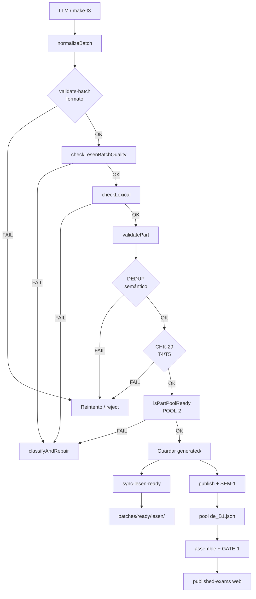

# LexiLoop — Auditoría completa del pipeline Lesen B1 (Gemini → examen web)

**Documento para análisis externo (Claude)** · Estado del repo: julio 2026  
**Objetivo:** describir con detalle todos los pipelines, gates y filtros desde que Gemini (o cualquier LLM) genera una parte Lesen hasta que el usuario Pro ve un examen en la web — incluyendo stock necesario, exámenes personalizados con vocabulario, problemas actuales en T4/T5, y un **prompt operativo para generar Lesen T3** listo para `batches/ready/lesen/`.

---

## 0. Resumen ejecutivo

| Concepto | Valor / ubicación |
|----------|-------------------|
| **Salida del generador** | `batches/generated/` (working copy, incluye intentos fallidos) |
| **Partes perfectas (mirror)** | `batches/ready/lesen/` — sync con `node scripts/sync-lesen-ready.mjs` |
| **Rechazadas** | `batches/generated/.rejected/` |
| **Pool reutilizable** | `library/reusable-seed/de_B1.json` |
| **Examen ensamblado (dev)** | `assembled-exam-b1-clean.json` |
| **Examen publicado web** | `library/published-exams/de/B1/official-de-B1-e1.json` |
| **Stock perfecto Lesen (jul 2026)** | T1=17 · T2=15 · T3=125 · T4=3 · T5=1 → **161 total** |
| **Cuota Pro exámenes oficiales/mes** | **12** (`PRO_QUOTA` en `js/bootstrap/state.js`) |
| **Créditos IA Pro / Pro Max** | 40 / 150 por mes · examen personal = **3 créditos** |
| **Cuello de botella actual** | **T4 y T5** (pocas perfectas; generación Gemini falla a menudo) |

---

## 1. Mapa de carpetas y flujo de datos

```
                    ┌─────────────────────────────────────┐
                    │  Gemini / Claude / make-t3 (T3)     │
                    └─────────────────┬───────────────────┘
                                      │
                                      ▼
                         batches/generated/*.json
                         (todas las partes nuevas)
                                      │
              ┌───────────────────────┼───────────────────────┐
              │                       │                       │
              ▼                       ▼                       ▼
     .rejected/ (fallos)    sync-lesen-ready.mjs      publish-lesen-generated
              │                       │                       │
              │                       ▼                       ▼
              │            batches/ready/lesen/     library/reusable-seed/de_B1.json
              │            (solo perfectas)                 │
              │                       │                       │
              └───────────────────────┴───────────────────────┘
                                      │
                                      ▼
                         assemble-clean-exam.mjs
                         (12 celdas → 1 examen)
                                      │
                                      ▼
                         assembled-exam-b1-clean.json
                         + isExamPublishable (GATE-1)
                                      │
                                      ▼
                         replace-published-b1.mjs / publish-exam.mjs
                                      │
                                      ▼
                         library/published-exams/de/B1/
                         (snapshots inmutables para la web)
```

**Importante:** `generated/` es el directorio de trabajo; `ready/` es una **vista curada** (copias byte-identicas de las que pasan el audit más estricto). El generador **no escribe directamente en ready/**; hay que sincronizar.

---

## 2. Pipeline completo paso a paso

### Fase A — Generación (`scripts/generate-lesen-part-gemini.mjs`)

**Entrada:** `--from-coverage`, `--from-bank`, o `--words` + `--teil N`  
**Salida:** `batches/generated/lesen-t{N}-gemini-NNN.json` (T3: `lesen-t3-auto-*.json` o `make-t3`)

| Teil | Motor | API |
|------|-------|-----|
| T1, T2, T4, T5 | Gemini (`gemini-2.5-flash`) | Sí |
| **T3** | **`make-t3.mjs`** (blueprints deterministas) | **No** (0 llamadas) |

**Por qué T3 no va por Gemini en producción:** el formato Goethe exige 7 situaciones + **10 anuncios A–J idénticos en las 7 preguntas**, exactamente **1× respuesta `"0"`**, sin repetir letras como clave, anti word-matching, familias temáticas con ≥2 competidores, etc. Los LLM suelen producir “Frankenstein L3” (listas A–J distintas por pregunta) → **CHK-17 CRITICAL**. Por eso el factory usa ~22 blueprints validados en `scripts/t3-blueprints/*.json`.

**Flujo interno de una parte (función `generateLlmPart` → bucle `fixRetries`):**

1. Resolver tema (`pickNextTopic`) y moldes T4/T5 (`resolveLesenGenerationMolds`)
2. Construir prompt (`buildLesenPrompt` + `plantillas-lesen-b1/lesen-teilN.md`)
3. Llamada LLM (`callGemini`)
4. Parse JSON → `coerceGeneratedLesenPart` → `normalizeBatch`
5. Tag topic: `tagBatchWithTopic`, `_requestedTopic`, `_debateTopic` (T4), `_textSubtype` (T5)
6. Vocab personalizado opcional: `attachVocabFeedback` si `_userVocab`
7. **`finalizeBatch`** → cadena de gates (ver §3)
8. Si falla → **`classifyAndRepair`** (§4) → reparación gratis o reintento LLM
9. CHK-29 en T4/T5 → `pushSessionMoldExclude` + regenerar sin consumir fix-retry
10. Si OK → escribir JSON en `generated/`

**Defaults relevantes:**
- `fix-retries`: **1** (T1–T3) · **2** (T4/T5)
- `api-retries`: 1
- Cuota sesión: 200 llamadas Gemini/día

---

### Fase B — Normalización (`scripts/lib/normalizeBatch.mjs`)

Siempre antes de cualquier gate:

- Decapitalización mid-sentence + capitalización de sustantivos alemanes (`capitalizeNouns.mjs`)
- Corrección MCQ T2/T5 (`balanceMcq.mjs`: balance a/b/c, anti-rachas)
- Normalización T3 (`normalizeT3.mjs`): formato matching, caps en opciones A–J
- Coerción de tipos, `correct` = `correctAnswer`, IDs

---

### Fase C — Validación de formato (`scripts/validate-batch.mjs`)

Invocado desde `finalizeBatch` vía `validateBatchFile`:

- JSON válido + schema Ajv (`library/schemas/questions.schema.json`)
- Campos obligatorios por ítem (`id`, `module`, `question`, `correct`)
- `correct` === `correctAnswer`
- `passageId` existente (Lesen T1/T2/T4/T5; T3: `passages: []`)
- Colocación en blueprint Goethe B1

**Gate id:** `formato`

---

### Fase D — Calidad pedagógica (`scripts/lib/lesenBatchQuality.mjs`)

Función: `checkLesenBatchQuality(batch, teil)`

| Teil | Comprobaciones clave |
|------|---------------------|
| **T1** | Word-matching situación↔pasaje, balance Richtig/Falsch, traps |
| **T2** | 2 pasajes × 3 preguntas, MCQ word-copy, `checkMcqDistinctIssues` |
| **T3** | 10 anuncios A–J, ≥1× `"0"`, ≥6 letras distintas, anti word-matching situación↔anuncio, ≥2 competidores temáticos, titular neutro, unicidad de letra clave |
| **T4** | Pregunta afirmativa (sin negación), coherencia Ja/Nein vs `signText`, sesgo Ja/Nein ≤62%, no copia literal foro |
| **T5** | MCQ word-copy (≥5 palabras), sesgo letras ≤60%, tono no educativo |

**Gate id:** `calidad` · También integrado en **`validatePart`** como bloqueo `QUALITY` (desde jul 2026)

---

### Fase E — Léxico (`scripts/lib/lexicalCheck.mjs`)

- Blacklist C1/C2 en texto alemán
- Errores gramaticales detectables
- Formato: `«TERM» → usa «SUGGESTION» (B1)`

**Gate id:** `lexico` · Reparable determinista (CUBO B) si sugerencia 1:1 sin `/`

---

### Fase F — Gate unificado de parte (`scripts/lib/partGate.mjs` → `validatePart`)

Orden estricto:

```
1. normalizeBatch (salvo skipNormalize)
2. checkLesenBatchQuality → QUALITY (bloqueante)
3. semanticDedup (opcional) → DEDUP (Jaccard ≥0.55 vs corpus generated/)
4. CHK-29 solo T4/T5 → structural mold vs batches/ready/lesen/ (preferido) o generated filtrado
5. isPartPoolReady → audit-pass-2 POOL-2 (+ SEM-1 si semantic:true)
6. Advisory CHK MINOR/INFO
```

**Export auxiliar:** `loadCleanStructuralCorpusFromDir` — corpus CHK-29 solo desde partes perfectas en `ready/`.

---

### Fase G — POOL-2 (`scripts/audit-pass-2.mjs` → `isPartPoolReady`)

Audita **una parte aislada** envuelta como mini-examen:

- Todos los **CRITICAL** bloquean
- Todos los **IMPORTANT** bloquean (salvo CHK-3 “Teil ausente” en parte suelta)
- Opcional **SEM-1** (`semanticValidator.mjs`) si `semantic: true` — **activo en publish**, no en factory loop
- Opcional **SEM-2** (`holisticJudge.mjs`) — solo Lesen T2, advise-only en generación

---

### Fase H — Reparación determinista (`scripts/lib/repairTriage.mjs`)

`classifyAndRepair(batch, gates)` — **antes** de gastar otro fix-retry LLM:

| Cubo | Qué repara | CHK / gate |
|------|------------|------------|
| **A** | Caps, balance MCQ, normalizeT3, dup IDs | CHK-14, 13, 19, 17, 8 |
| **B** | Sustitución léxica 1:1 | `lexico` |
| **A (T4)** | Clave Ja/Nein invertida | `calidad` + `signTextStance` |
| **C** | LLM localizado | word-match T1/T2/T5, mcq_distinct, CHK-18/7/16/10/15/28 |
| **D** | Descartar | dedup, batch vacío, ≥6 issues mezclados |

Reparaciones localizadas:
- `wordMatchRepair.mjs` — T1/T2/T5
- `l2McqDistinctRepair.mjs` — T2/T5 opciones

---

### Fase I — Sync a carpeta ready (`scripts/sync-lesen-ready.mjs`)

Criterio **“perfecta”** (`scripts/lib/lesenReadyLib.mjs`):

1. Pasa `discoverPool2ReadyLesen` (validatePart con dedup off, CHK-29 vs generated)
2. **Y además:** `checkLesenBatchQuality` OK
3. **Y además:** `checkLexical` OK
4. **Y además:** `isPartPoolReady` OK

Copia a `batches/ready/lesen/` + `_manifest.json`.

Comando audit:

```bash
node scripts/audit-lesen-pool2-ready.mjs
node scripts/sync-lesen-ready.mjs
```

---

### Fase J — Publicación al pool (`scripts/publish-lesen-generated.mjs`)

1. Lee JSON de `generated/`
2. **`isPartPoolReady(record, { semantic: true })`** — incluye SEM-1
3. `ingest-to-staging.mjs` → `promote-approved.mjs`
4. Append a `library/reusable-seed/de_B1.json` vía `publishToPool.mjs`
5. Dedup por celda topicTag×Teil

---

### Fase K — Ensamblaje de examen (`scripts/assemble-clean-exam.mjs`)

**12 celdas oficiales** (`publishedExamLib.mjs` → `OFFICIAL_CELLS`):

| Módulo | Teile |
|--------|-------|
| Lesen | 1–5 |
| Hören | 1–4 |
| Schreiben | 1–3 |

Cada celda: parte de `generated/` (PICKS hardcoded) o pool (`schreiben`).

**GATE-1:** `isExamPublishable(assembled)` — examen completo:

- Todos CRITICAL
- IMPORTANT en `GATE_BLOCK_CHECKS` (subset estricto, ver §5)
- CHK-18 en `GATE_BLOCK_PENDING` (advisory hoy)

Salida: `assembled-exam-b1-clean.json` con `_meta.partIds`, `keySequences`.

---

### Fase L — Publicación web oficial (`scripts/replace-published-b1.mjs`)

1. Carga `assembled-exam-b1-clean.json`
2. Verifica GATE-1 + POOL-2 por parte
3. `buildPublishedExamDoc` → snapshots inmutables por celda
4. Escribe `library/published-exams/de/B1/official-de-B1-e1.json`
5. Catálogo `_catalog.json` (actualmente solo E1 live)

**E1 actual (jul 2026):** Lesen T1 = `lesen-t1-gemini-174` (reemplazó la defectuosa `118` movida a `.rejected/`).

---

### Fase M — Exámenes personalizados Pro (runtime web)

**No usan `generated/` directamente** — flujo híbrido:

| Componente | Archivo |
|------------|---------|
| Plan pool vs live | `scripts/lib/hybridExamPlan.mjs` → `computeHybridPlan` |
| Ejecución | `scripts/lib/hybridLesenAssembly.mjs` |
| Web UI | `js/ui/exam/examGeneration.js` |
| API live | `netlify/functions/claude-chat.js` |
| Ticket + créditos | `netlify/functions/lib/genTicket.js`, `aiCredits.js` |

**Reglas híbridas:**
- Maximizar partes del **pool** que cubren vocab del usuario (`buscar` + score ≥ threshold)
- **Máximo 1 Teil lento (T1/T2) en live** por examen, salvo pool vacío para esa celda
- T3/T4/T5 tienden a live si el pool no cubre vocab o stock bajo
- `personal_exam` cuesta **3 créditos IA** (no consume cuota mensual de 12 exámenes oficiales)
- POOL-2 gate en delivery para chunks live (`claude-chat.js`)

---

## 3. Diagrama de gates por capa



---

## 4. Catálogo completo de checks (CHK y otros)

### 4.1 Checks en `audit-pass-2.mjs` (auditExam / isPartPoolReady)

| ID | Teil / scope | Severidad típica | Descripción breve |
|----|--------------|------------------|-------------------|
| CHK-1 | All | CRITICAL | Tipos de pregunta canónicos |
| CHK-2 | All | CRITICAL | `correct` válido y = `correctAnswer` |
| CHK-3 | Exam | CRITICAL | Conteo ítems vs blueprint |
| CHK-3b | Exam | CRITICAL | Teil entero ausente |
| CHK-4 | All | IMPORTANT | Balance de respuestas |
| CHK-5 | Cross-passage | IMPORTANT | Pasajes duplicados en examen |
| CHK-6 | All | IMPORTANT | Blacklist C1/C2 |
| CHK-7 | L4 | CRITICAL/IMPORTANT | Preguntas afirmativas; Ja/Nein vs signText; balance 3–4 Ja |
| CHK-8 | All | CRITICAL | IDs únicos, campos requeridos |
| CHK-9 | Schreiben | — | Beispiel ausente |
| CHK-10 | L1, H1 | IMPORTANT | Trampas absolutas de idioma |
| CHK-11 | H4 | — | Speaker/key Hören T4 |
| CHK-12 | RF blocks | IMPORTANT | Balance Richtig/Falsch |
| CHK-13 | MC | IMPORTANT | MCQ usa a/b/c, ninguna >55% |
| CHK-14 | DE text | IMPORTANT | Sustantivos en minúscula |
| CHK-14b | DE text | IMPORTANT | Adjetivos en mayúscula errónea |
| CHK-14c | L2/T5 MCQ | IMPORTANT | **GATE_BLOCK** — caps en opciones |
| CHK-15 | Passages/signText | IMPORTANT | Conteo palabras (T5 pasaje 130–280) |
| CHK-16 | L1, H3 | IMPORTANT | Word-matching ≥4 palabras |
| CHK-17 | L3 | CRITICAL/IMPORTANT | **GATE_BLOCK** — lista A–J compartida |
| CHK-18 | All | IMPORTANT | Calidad explanation (pending block) |
| CHK-18b | L2/T5 | IMPORTANT | **GATE_BLOCK** — clave ≠ explanation |
| CHK-19 | All | IMPORTANT | ≥4 respuestas iguales seguidas |
| CHK-20 | H1 | IMPORTANT | **GATE_BLOCK** — 5×(1RF+1MC) |
| CHK-21 | L4 | IMPORTANT | **GATE_BLOCK** — signText ≥15w, autores únicos |
| CHK-22 | L4 | CRITICAL | **GATE_BLOCK** — un solo passageId |
| CHK-23 | Hören | CRITICAL | segments vs questions |
| CHK-24 | MC | IMPORTANT | Case canónico multiple_choice |
| CHK-25 | Cross-parts | INFO→CRITICAL | Secuencias de claves idénticas |
| CHK-26 | All | IMPORTANT | **GATE_BLOCK** — topicTag coherente |
| CHK-27 | L4 | IMPORTANT | **GATE_BLOCK** — debate alineado al tema |
| CHK-28 | L2 | IMPORTANT | **GATE_BLOCK** — opciones no excluyentes |
| CHK-29 | L4/L5 | IMPORTANT | Molde estructural duplicado (partGate, no auditExam) |

**Otros IDs:** `DEDUP`, `QUALITY`, `SEM-*`, `AUDIT-ERROR`

### 4.2 GATE-1 vs POOL-2

- **POOL-2:** cualquier CRITICAL o IMPORTANT bloquea (parte suelta)
- **GATE-1:** CRITICAL + subset `GATE_BLOCK_CHECKS` (líneas 2385–2396 `audit-pass-2.mjs`)
- **GATE_BLOCK_PENDING:** CHK-18 (explanations) — advisory hasta POOL-5

### 4.3 SEM-1 / SEM-2

- **SEM-1:** ambigüedad, distractor débil, template — **obligatorio al publicar al pool**
- **SEM-2:** juez holístico T2 — activo en delivery web, no en factory Gemini

---

## 5. Problemas actuales en Lesen T4 y T5

### 5.1 Lesen T4 (foro Ja/Nein)

**Formato:** 1 pasaje foro + 7 preguntas `type: ja_nein` + `signText` por pregunta.

| Problema | Check | Frecuencia en generación reciente | Mitigación en código |
|----------|-------|-----------------------------------|----------------------|
| Debate no coincide con tema pedido | **CHK-27** | Alta — p.ej. foro «Ernährung/Stadtleben/Freizeit» con `topicTag` Konsum/Gesundheit/Kultur | Rotación `_debateTopic`; prompt exige debate del tema |
| Clave Ja/Nein invertida vs postura del signText | **CHK-7** + calidad | Media | `fixT4InvertedKeys` en repairTriage (CUBO A) |
| Sesgo Ja >62% o Nein >62% | calidad T4 | Media | Reescribir signTexts |
| signText demasiado corto / autores duplicados | **CHK-21** | Media | Regenerar opiniones |
| Molde debate ya usado en celda topic×T4 | **CHK-29** | Baja tras corpus `ready/` | `pushSessionMoldExclude`, excluir subtipos |
| Léxico B2 en explanation | **lexico** | Media | Sustitución CUBO B o reintento |
| Negación en texto de pregunta | calidad + CHK-7 | Baja | Prompt: solo preguntas afirmativas «Ist X FÜR den Vorschlag?» |

**Intentos recientes (jul 2026):** 0/3 guardadas — fallos CHK-27 (tema) y antes CHK-29 (corpus sucio, ya corregido).

**Stock:** solo **3 T4 perfectas** en ready — insuficiente para 12 exámenes distintos.

---

### 5.2 Lesen T5 (reglamento MCQ)

**Formato:** 1 pasaje reglamento/aviso 130–280 palabras + 6 MCQ a/b/c.

| Problema | Check | Frecuencia | Mitigación |
|----------|-------|------------|------------|
| Clave MCQ no coincide con explanation | **CHK-18b** | **Alta** | Reintento LLM; no hay repair determinista fiable |
| Pasaje demasiado largo/corto | **CHK-15** | Media — p.ej. 284 palabras (máx 280) | Recortar pasaje en reintento |
| Word-copy opción correcta | calidad T5 | Media | `wordMatchRepair` |
| Opciones no excluyentes | CHK-28 / mcq_distinct | Media | `l2McqDistinctRepair` |
| Caps erróneas en opciones | **CHK-14c** | Baja | normalizeBatch + CUBO A |
| Molde subtipo duplicado | **CHK-29** | Baja | Rotar `_textSubtype` |
| Sesgo letra correcta >60% | calidad | Baja | balanceMcq |

**Intentos recientes:** 0/3 guardadas — CHK-18b y CHK-15.

**Stock:** solo **1 T5 perfecta** en ready.

---

### 5.3 Por qué T3 es la parte “más complicada” para un LLM (pero la más fácil en factory)

Para **Claude/Gemini sin blueprint**, T3 es la más difícil porque:

1. **CHK-17 / Frankenstein:** 7× el mismo array `options` byte-identico
2. **Matching formal:** exactamente 7 preguntas, 1× `"0"`, sin repetir letras A–J como clave
3. **Pedagogía:** familias temáticas, ≥2 competidores, titular neutro, anti word-matching
4. **Edad:** reglas youth vs adult-only (`t3AgeAlignmentError`)
5. **Sin pasaje:** `passages: []` — modelo confunde con MCQ normal

En **producción LexiLoop**, T3 se genera con **`make-t3.mjs`** desde blueprints ya validados → tasa de éxito ~100% sin API.

**Recomendación para Claude:** si el objetivo es llenar `ready/`, T3 vía LLM es viable **siguiendo el prompt de §8 al pie de la letra**; alternativamente usar `node scripts/make-t3.mjs --count N` (determinista, gratis).

---

## 6. Cantidades necesarias: 12 exámenes Pro + personalizados

### 6.1 Doce exámenes oficiales completos (sin reutilizar partes)

Cada examen B1 = **12 celdas** (5 Lesen + 4 Hören + 3 Schreiben).

| Recurso | Mínimo para 12 exámenes **distintos** |
|---------|---------------------------------------|
| **Total partes (todas las celdas)** | 12 × 12 = **144** |
| **Solo Lesen (5 Teile × 12)** | **60 partes** |
| **Por celda Lesen** | **12 partes únicas** por T1…T5 |

**Stock Lesen perfecto actual vs objetivo 12:**

| Teil | En ready | Necesario | Déficit | Superávit |
|------|----------|-----------|---------|-----------|
| T1 | 17 | 12 | — | +5 |
| T2 | 15 | 12 | — | +3 |
| T3 | 125 | 12 | — | +113 |
| **T4** | **3** | **12** | **−9** | — |
| **T5** | **1** | **12** | **−11** | — |

**Conclusión Lesen:** hay que generar **~9 T4 + ~11 T5** perfectas adicionales (más margen SEM-1/dedup: **+2–3 por Teil** recomendado → **~12 T4 y ~14 T5**).

Para **144 celdas completas** (incl. Hören/Schreiben), auditar también:

```bash
node scripts/audit-exam-pool.mjs
```

---

### 6.2 Exámenes personalizados Pro (vocabulario del usuario)

**Separado de los 12 exámenes oficiales/mes:**

| Plan | Cuota exámenes mock/mes | Créditos IA/mes | Coste `personal_exam` |
|------|-------------------------|-----------------|------------------------|
| Free | 5 | 6 (trial) | No disponible |
| Guest | 2 | 0 | No |
| **Pro** | **12** (+ retakes gratis) | **40** | **3 créditos** |
| **Pro Max** | **12** | **150** | **3 créditos** |

**Máximo teórico de exámenes Lesen personalizados/mes (si todo fuera live):**
- Pro: ⌊40 / 3⌋ = **13** sesiones `personal_exam`
- Pro Max: ⌊150 / 3⌋ = **50**

**En la práctica (híbrido):** no se generan 5 Teile live siempre. `computeHybridPlan` asigna:
- Partes del **pool** cuando cubren ≥ threshold del vocab del usuario
- **Live** solo celdas restantes (prioridad stock bajo: T3/T4/T5; máx 1 T1/T2 live)

**Implicación para stock de pool:**

Para que el usuario Pro **no agote live gen** en cada examen personal, el pool debe tener **muchas partes por celda topicTag×Teil** con índice de vocab (`vocabIndex` en records). Objetivo operativo (código `fill-pool-deficit-b1.mjs`):

- **≥5 partes limpias por celda** = mínimo para **1** examen + margen SEM-1
- Para personalización masiva: **≥20–30 por celda Lesen** ideal (5 temas × 5 Teile × diversidad vocab)

**Partes live típicas por examen personal Lesen:** 1–3 (no 5). Créditos consumidos: **3 por examen** independientemente de cuántos Teile sean live (un ticket `personal_exam`).

---

## 7. Comandos de validación (checklist post-generación)

Tras generar un JSON (Claude, Gemini, o make-t3):

```bash
# 1. Formato
node scripts/validate-batch.mjs --lang de --level B1 --file batches/generated/MI-PARTE.json

# 2. Calidad pedagógica
node scripts/check-lesen-batch-quality.mjs --file batches/generated/MI-PARTE.json --teil 3

# 3. Audit POOL-2 + calidad + léxico (una parte)
node scripts/audit-lesen-pool2-ready.mjs

# 4. Copiar a ready si perfecta
node scripts/sync-lesen-ready.mjs

# 5. (Opcional) Publicar al pool con SEM-1
node scripts/publish-lesen-generated.mjs --file batches/generated/MI-PARTE.json --publish
```

---

## 8. PROMPT PARA CLAUDE — Generar Lesen T3 listo para `ready/`

> **Uso:** copiar §8.1 + §8.2 + §8.3 en Claude. Adjuntar o pegar el contenido de `plantillas-lesen-b1/lesen-teil3.md` y un ejemplo blueprint de `scripts/t3-blueprints/bp-reparatur-kurse.json` (opcional).
> **Salida esperada:** un solo JSON → guardar en `batches/generated/lesen-t3-claude-XXX.json` → validar con §7.

### 8.1 Contexto de sistema (pegar una vez)

```
Eres un generador de contenidos para el Goethe-Zertifikat B1 (Lesen Teil 3).
Tu salida será validada por un pipeline automático con 15+ checks. Un solo error
estructural rechaza la parte. Devuelve SOLO JSON válido, sin markdown ni comentarios.

Archivos de referencia del proyecto (si tienes acceso):
- plantillas-lesen-b1/lesen-teil3.md — reglas pedagógicas completas
- scripts/lib/lesenBatchQuality.mjs — función checkTeil3
- scripts/audit-pass-2.mjs — CHK-17, CHK-26
- js/data/b1Topics.js — lista cerrada de topicTag

Criterio "ready": pasa validate-batch + checkLesenBatchQuality + checkLexical +
isPartPoolReady (POOL-2). La parte irá a batches/ready/lesen/.
```

### 8.2 Reglas duras (no negociables)

1. **Exactamente 7 preguntas**, todas `type: "matching"`, `module: "lesen"`, `teil: 3`, `lang: "de"`, `level: "B1"`.
2. **`passages: []`** — sin pasaje prose. Anuncios solo en `questions[].options`.
3. **10 anuncios A)…J)** — el array `options` debe ser **idéntico en las 7 preguntas** (mismo orden, mismas 10 líneas).
4. **Claves:** solo letras **A–J** o **`"0"`** (string). Exactamente **1** pregunta con `"correct": "0"`. **Ninguna** otra letra repetida como clave entre las 6 restantes.
5. **≥6 letras distintas** usadas como clave (objetivo pedagógico).
6. **Anti word-matching:** situación ↔ anuncio correcto comparten **≤1** palabra ≥4 letras. Titular del anuncio **neutro** (no repetir sustantivos clave de la situación).
7. **Competidores:** cada situación con clave A–J debe tener **≥2** otros anuncios de la **misma familia temática** que distraigan.
8. **Longitud anuncio:** 25–45 palabras ideal (mín 20, máx 60 por línea A–J).
9. **≥4 anuncios** con restricción horaria (`Mo–Fr`, `Uhr`, `Termin`, `nur`, etc.).
10. **`correct` === `correctAnswer`** en cada ítem. Sin `passageId`. IDs únicos `gen-q-3-{hex}-{1..7}`.
11. **Explanations** ≥10 palabras, en alemán, que justifiquen por significado (no copiar titular).
12. **`topicTag`** coherente con el contenido (uno de: Reisen, Gesundheit, Arbeit, Technik, Medien, Wohnen, Konsum, Bildung, Familie, Umwelt, Ernährung, Kultur, Sport, Freizeit, Verkehr, Stadtleben).
13. **PROHIBIDO:** anuncio K), `correct: null`, listas options distintas entre preguntas, 6 u 8 preguntas.

### 8.3 Rotación automática tema + vocabulario (instrucción al operador humano o a Claude en sesión larga)

**Variables de sesión** (el humano las actualiza cada N generaciones):

```
GENERATION_INDEX = 1   # incrementar tras cada parte guardada
TOPIC_ROTATE_EVERY = 3 # cambiar topicTag cada 3 partes
VOCAB_ROTATE_EVERY = 1 # cambiar set de palabras cada parte
```

**Algoritmo de rotación:**

```javascript
const TOPICS = ['Reisen','Gesundheit','Arbeit','Technik','Medien','Wohnen',
  'Konsum','Bildung','Familie','Umwelt','Ernährung','Kultur','Sport',
  'Freizeit','Verkehr','Stadtleben'];

const VOCAB_POOLS = [
  ['termin','kurs','anmeldung','gebühr','beratung','organisation','stadt','familie'],
  ['reparieren','transport','hausbesuch','miete','shop','wochenende','kurs','termin'],
  ['reisen','hotel','flug','gepäck','versicherung','anmeldung','sprache','kurs'],
  ['gesundheit','sport','ernährung','termin','beratung','kurs','familie','organisation'],
  ['technik','computer','internet','reparieren','kurs','anmeldung','shop','termin'],
  // … ampliar desde data/coverage/weak-de_B1.json
];

topic = TOPICS[Math.floor((GENERATION_INDEX - 1) / TOPIC_ROTATE_EVERY) % TOPICS.length];
words = VOCAB_POOLS[(GENERATION_INDEX - 1) % VOCAB_POOLS.length].slice(0, 8);
```

**En el prompt de cada generación, incluir:**

```
GENERATION_INDEX: {N}
topicTag obligatorio: "{topic}"
PALABRAS OBJETIVO (5–8, integrar en ANUNCIOS no en situaciones): {word1}, {word2}, …

Antes del JSON, completa mentalmente la tabla PASO 0 de familias (plantilla teil3).
Genera UNA parte NUEVA distinta a todas las anteriores de esta sesión.
Campo raíz opcional: "_requestedTopic": "{topic}"
Tras generar, incrementa GENERATION_INDEX.
```

### 8.4 Prompt de generación (copiar y rellenar variables)

```
Genera UNA parte Lesen B1 Teil 3 (matching A–J + situaciones) según las reglas duras §8.2.

topicTag / _requestedTopic: <<<TOPIC>>>
PALABRAS OBJETIVO (integrar en anuncios A–J): <<<WORDS>>>

PASO 0 obligatorio (mostrar tabla antes del JSON en tu razonamiento interno, NO en la salida):
- Asigna familia temática a cada anuncio A–J
- 7 situaciones con respuesta (1× "0", 6 letras distintas A–J)
- Verifica ≥2 competidores por situación A–J

Devuelve SOLO:
{
  "passages": [],
  "questions": [ … 7 ítems … ],
  "topicTag": "<<<TOPIC>>>",
  "_requestedTopic": "<<<TOPIC>>>"
}

Imita la estructura del ejemplo verificado en plantillas-lesen-b1/lesen-teil3.md
(sección EJEMPLO VERIFICADO) pero con anuncios y situaciones 100% nuevos.
```

### 8.5 Autocontrol antes de entregar (Claude debe verificar)

- [ ] 7 preguntas, 10 options idénticos ×7
- [ ] 1× `"0"`, 6 letras únicas A–J
- [ ] Sin K), sin null, sin passageId
- [ ] Cada situación A–J: ≥2 competidores temáticos
- [ ] Word-matching: ≤1 palabra compartida situación↔anuncio correcto
- [ ] topicTag en lista B1_TOPICS
- [ ] correct === correctAnswer
- [ ] JSON parseable

---

## 9. ¿T3 u otra parte para Claude?

| Teil | Dificultad LLM | Prioridad stock | Recomendación |
|------|----------------|-----------------|---------------|
| T3 | Muy alta (formato) | OK (125 ready) | Solo si quieres **diversidad blueprint nueva**; usa make-t3 en terminal |
| **T4** | Alta (CHK-27 tema) | **Crítico (−9)** | **Prioridad #1** para Claude si mejoras prompt debate/tema |
| **T5** | Alta (CHK-18b) | **Crítico (−11)** | **Prioridad #2** — plantilla `lesen-teil5.md` |
| T1 | Media (word-copy) | OK (+5) | Baja prioridad |
| T2 | Media-alta (mcq_distinct) | OK (+3) | Baja prioridad |

**Para llenar los 12 exámenes Pro:** enfocar generación en **T4 y T5**. T3 ya sobra; usar `make-t3.mjs` para volumen sin coste API.

---

## 10. Archivos clave (referencia rápida)

| Función | Ruta |
|---------|------|
| Generador Lesen | `scripts/generate-lesen-part-gemini.mjs` |
| T3 determinista | `scripts/make-t3.mjs`, `scripts/t3-blueprints/*.json` |
| Gate unificado | `scripts/lib/partGate.mjs` |
| Auditoría POOL-2 | `scripts/audit-pass-2.mjs` |
| Calidad pedagógica | `scripts/lib/lesenBatchQuality.mjs` |
| Reparación | `scripts/lib/repairTriage.mjs` |
| CHK-29 moldes | `scripts/lib/structuralMoldDedup.mjs` |
| Sync ready | `scripts/sync-lesen-ready.mjs`, `scripts/lib/lesenReadyLib.mjs` |
| Audit ready | `scripts/audit-lesen-pool2-ready.mjs` |
| Publicar pool | `scripts/publish-lesen-generated.mjs` |
| Ensamblar examen | `scripts/assemble-clean-exam.mjs` |
| Publicar web | `scripts/replace-published-b1.mjs`, `scripts/lib/publishedExamLib.mjs` |
| Stock exámenes | `scripts/audit-exam-pool.mjs` |
| Plan híbrido Pro | `scripts/lib/hybridExamPlan.mjs` |
| Plantillas prompt | `plantillas-lesen-b1/lesen-teil1.md` … `lesen-teil5.md` |
| Temas B1 | `js/data/b1Topics.js` |
| Cuotas Pro | `js/bootstrap/state.js`, `netlify/functions/lib/aiCredits.js` |

---

## 11. Preguntas abiertas (para Claude analista)

1. ¿Conviene mover T4/T5 a un pipeline de **2 pasos** (pasaje → preguntas) como T3 con blueprints?
2. ¿Relajar CHK-27 con whitelist semántica (Ernährung ⊂ Gesundheit) o mantener strict?
3. ¿Activar CHK-18 (explanations) en GATE_BLOCK ya, dado el fallo sistemático T5?
4. ¿Cuántas variantes de `_debateTopic` / `_textSubtype` hacen falta por topicTag para evitar CHK-29 con 12 exámenes?
5. ¿El prompt T3 de §8 debería exigir `_blueprintSlug` ficticio para trazabilidad?

---

*Generado para revisión externa. Repo: lexiloop · julio 2026.*
